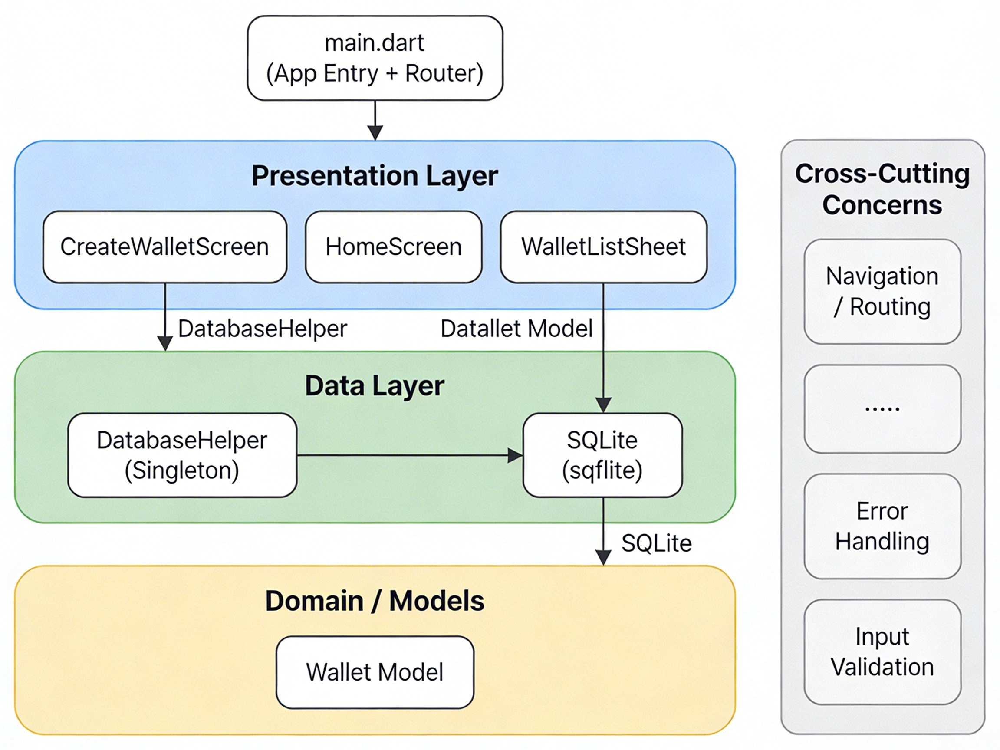
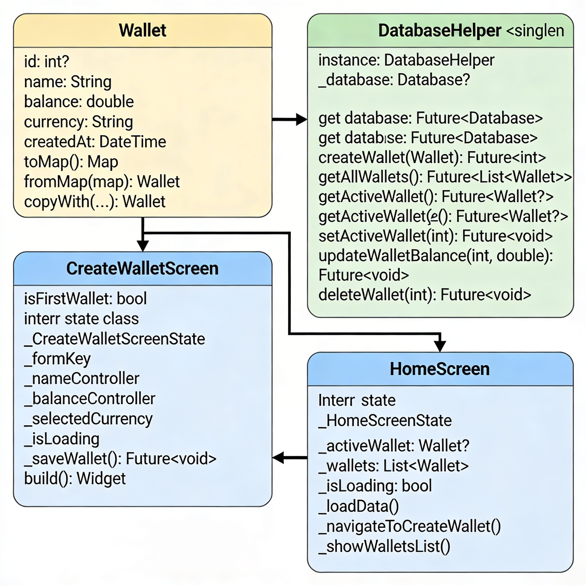

# Лабораторная работа №3: Исследование архитектурного решения
**Приложение:** Money Flow — мобильное приложение для учёта личных финансов  
**Технология:** Flutter (Dart), SQLite (sqflite)  
**Платформы:** Android, iOS

***
## Часть 1. Проектирование архитектуры (To Be)
### 1. Тип приложения
Money Flow — **мобильное клиентское приложение** (Rich Client Application) для платформ Android и iOS. Приложение работает автономно на устройстве пользователя, хранит данные локально и не требует постоянного подключения к серверу. Такой тип приложения характеризуется богатым пользовательским интерфейсом, прямым взаимодействием с пользователем и локальным хранением данных.[^1][^2]
### 2. Стратегия развёртывания
Приложение развёртывается как **автономное мобильное приложение** с единой кодовой базой на Flutter, компилируемой под две платформы:[^3][^4]

- **Android** — публикация через Google Play Store (APK/AAB)
- **iOS** — публикация через Apple App Store (IPA)

Данные хранятся **локально** в SQLite-базе на устройстве. Серверная инфраструктура на текущем этапе не требуется, что упрощает развёртывание и снижает стоимость поддержки.
### 3. Обоснование выбора технологий
| Технология | Назначение | Обоснование |
|-----------|-----------|-------------|
| Flutter (Dart) | UI-фреймворк | Единая кодовая база для Android и iOS, высокая скорость разработки, богатая библиотека виджетов Material Design |
| SQLite (sqflite) | Локальная БД | Лёгкая встраиваемая БД, не требует сервера, поддерживает SQL-запросы, идеальна для хранения структурированных финансовых данных |
| path_provider | Доступ к файловой системе | Кроссплатформенный доступ к директориям для хранения БД |
| intl | Локализация и форматирование | Форматирование дат и чисел с учётом локали пользователя |
### 4. Показатели качества
На основании рекомендаций «Руководства Microsoft по проектированию архитектуры приложений» (глава 2) определены следующие ключевые показатели качества:

- **Производительность** — мгновенный отклик интерфейса при добавлении операций и подсчёте баланса. SQLite обеспечивает быстрые запросы на локальных данных.
- **Удобство использования (Usability)** — интуитивный интерфейс по стандартам Material Design. Минимум шагов для ключевых действий (создание кошелька, добавление операции).
- **Надёжность (Reliability)** — данные сохраняются в локальной БД с транзакциями. Валидация ввода предотвращает некорректные данные.
- **Сопровождаемость (Maintainability)** — разделение на слои позволяет модифицировать UI независимо от логики хранения данных.
- **Безопасность** — данные хранятся в защищённом хранилище устройства, доступном только приложению.
### 5. Сквозная функциональность (Cross-Cutting Concerns)
Сквозная функциональность — это аспекты системы, которые затрагивают несколько компонентов и не относятся напрямую к бизнес-логике:

| Сквозная функциональность | Реализация в Money Flow |
|--------------------------|------------------------|
| **Навигация / Маршрутизация** | Централизованная система маршрутов в `main.dart` через `MaterialApp.routes`. Все экраны доступны через именованные маршруты|
| **Обработка ошибок** | Try-catch блоки в методах работы с БД, отображение SnackBar при ошибках. Единообразный подход во всех экранах |
| **Валидация ввода** | Встроенная валидация форм через `Form` + `TextFormField.validator`. Проверка корректности email, суммы, обязательных полей |
| **Управление состоянием** | `setState()` для реактивного обновления UI при изменении данных. В будущем — миграция на Provider/Bloc |
| **Логирование** | `print()` для отладочного логирования. В продакшн-версии планируется использование пакета `logger`|
### 6. Структурная схема приложения (Архитектура To Be)

Архитектура Money Flow построена по принципу разделения на слои (Layered Architecture), что соответствует рекомендациям из «Руководства Microsoft по моделированию приложений» и принципам Clean Architecture для Flutter:[^1][^3][^4][^2][^5]
**Слои приложения:**

- **Presentation Layer (Слой представления)** — Flutter-виджеты (экраны): `CreateWalletScreen`, `HomeScreen`, `WalletListSheet`. Отвечает за отображение данных и обработку действий пользователя.
- **Data Layer (Слой данных)** — `DatabaseHelper` (синглтон) инкапсулирует всю работу с SQLite: CRUD-операции, запросы, управление транзакциями.
- **Domain / Models (Доменный слой)** — модель `Wallet` описывает структуру данных, методы сериализации (`toMap`/`fromMap`) и бизнес-правила.
- **Cross-Cutting Concerns** — навигация, обработка ошибок, валидация ввода — пронизывают все слои.

Связи между слоями **однонаправленные**: Presentation → Data → Models. Верхние слои зависят от нижних, но не наоборот.

***
## Часть 2. Анализ архитектуры (As Is)

На основе реального кода первого спринта (таски SCRUM-16, SCRUM-17, SCRUM-18) построена диаграмма классов, отражающая текущую структуру приложения:
### Описание классов текущей реализации
**Wallet (модель данных):**
- Поля: `id`, `name`, `balance`, `currency`, `isActive`, `createdAt`
- Методы: `toMap()`, `fromMap()`, `copyWith()`
- Роль: объект предметной области, используемый всеми компонентами

**DatabaseHelper (доступ к данным):**
- Паттерн Singleton (`instance`)
- CRUD-методы: `createWallet`, `getAllWallets`, `getActiveWallet`, `setActiveWallet`, `updateWalletBalance`, `deleteWallet`
- Инициализация БД: создание таблиц `wallets` и `transactions`

**CreateWalletScreen (UI + логика создания):**
- StatefulWidget с формой (TextFormField, DropdownButtonFormField)
- Валидация ввода через `_formKey`
- Метод `_saveWallet()` напрямую вызывает `DatabaseHelper.instance.createWallet()`

**HomeScreen (главный экран):**
- StatefulWidget, загружает данные через `DatabaseHelper`
- Хранит состояние: `_activeWallet`, `_wallets`, `_isLoading`
- Отображает баланс, карточки доходов/расходов, список операций

***
## Часть 3. Сравнение и рефакторинг
### Сравнение архитектур As Is и To Be
| Аспект | To Be (целевая) | As Is (текущая) | Соответствие |
|--------|----------------|-----------------|-------------|
| Разделение на слои | 3 слоя: Presentation, Data, Domain | Файлы разнесены по папкам (`screens/`, `database/`, `models/`), но слои не строго изолированы | ✅ Частично |
| Модель данных | Wallet — чистая доменная модель | Wallet содержит `toMap()`/`fromMap()` (привязка к SQLite) | ⚠️ Модель смешивает домен и данные |
| Доступ к данным | DatabaseHelper инкапсулирует БД | Реализовано через Singleton, экраны обращаются напрямую | ✅ Соответствует |
| Связь экранов с данными | Через абстракции (репозитории) | Прямой вызов `DatabaseHelper.instance` из виджетов | ❌ Нет абстракции |
| Управление состоянием | Provider/Bloc | `setState()` | ⚠️ Упрощённо для MVP |
| Сквозная функциональность | Выделена отдельно | Встроена в экраны (валидация в виджетах, обработка ошибок в try-catch) | ⚠️ Не вынесена |
### Анализ отличий и их причины
1. **Прямая зависимость экранов от DatabaseHelper.** В текущей реализации `CreateWalletScreen` и `HomeScreen` напрямую вызывают `DatabaseHelper.instance`. Это нарушает принцип инверсии зависимостей (Dependency Inversion Principle). Причина: на этапе MVP для одного разработчика прямой вызов проще и быстрее, чем создание интерфейсов и DI.

2. **Модель Wallet содержит методы сериализации.** В Clean Architecture модель домена не должна зависеть от способа хранения. Методы `toMap()`/`fromMap()` привязывают модель к SQLite. Причина: для простого приложения с одним источником данных отдельный маппер избыточен на старте.

3. **setState() вместо state management.** Использование `setState()` достаточно для небольшого приложения, но при росте числа экранов и общих данных приведёт к дублированию логики и сложности поддержки.
### Пути улучшения архитектуры
1. **Ввести абстракцию репозитория.** Создать интерфейс `WalletRepository` и реализацию `SqliteWalletRepository`. Экраны будут зависеть от абстракции, а не от конкретной реализации. Это позволит в будущем безболезненно заменить SQLite на Firebase или REST API.

2. **Вынести маппинг из модели.** Создать отдельный класс `WalletMapper` или DTO `WalletEntity` для слоя данных. Модель `Wallet` станет чистой доменной сущностью без зависимости от формата хранения.

3. **Внедрить state management.** Перейти на Provider или Bloc для управления состоянием. Это обеспечит реактивное обновление UI без ручного вызова `setState()` и упростит передачу данных между экранами.

4. **Централизовать сквозную функциональность.** Вынести валидацию в отдельные классы-валидаторы. Создать единый ErrorHandler для обработки ошибок с логированием. Использовать NavigationService для централизации маршрутизации.

5. **Применить паттерн «Наблюдатель»** для уведомления экранов об изменении данных в БД, вместо ручного вызова `_loadData()` после каждой операции.
### Вывод
Текущая архитектура (As Is) приложения Money Flow в целом соответствует целевой (To Be) на базовом уровне: код разделён по папкам согласно слоям, модель данных отделена от экранов, работа с БД инкапсулирована в синглтоне DatabaseHelper. Для первого спринта и MVP одного разработчика это оправданный компромисс между скоростью разработки и архитектурной чистотой.

Основные расхождения — прямая зависимость экранов от DatabaseHelper, отсутствие абстракций репозиториев и упрощённое управление состоянием — являются типичными для ранних стадий разработки и легко устраняются в последующих спринтах через введение интерфейсов, DI-контейнера и state management (Provider/Bloc). Принципы проектирования из «Руководства Microsoft по архитектуре приложений» — разделение ответственности, минимизация связности, выделение сквозной функциональности — заложены в целевую архитектуру и будут последовательно реализованы по мере развития проекта.
