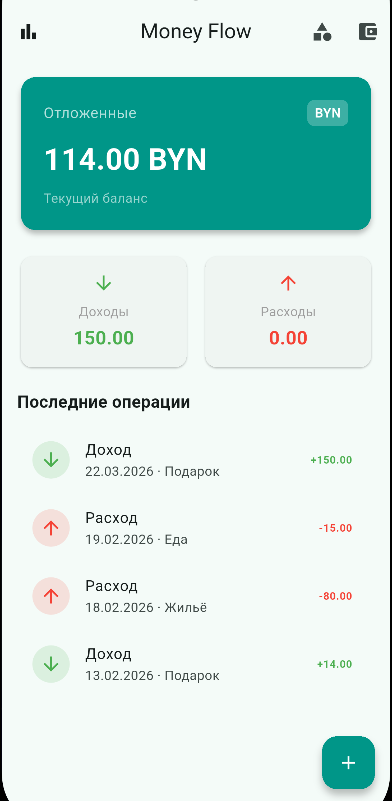
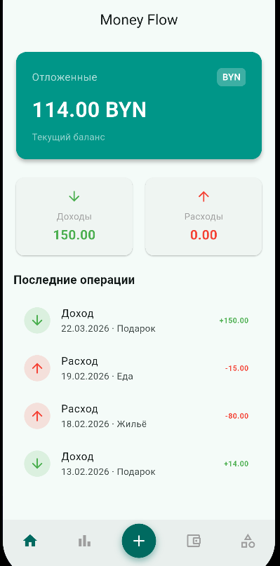
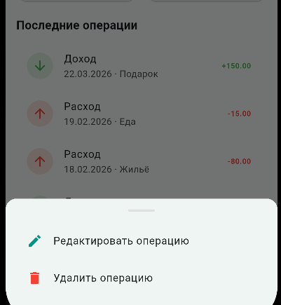
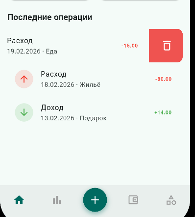
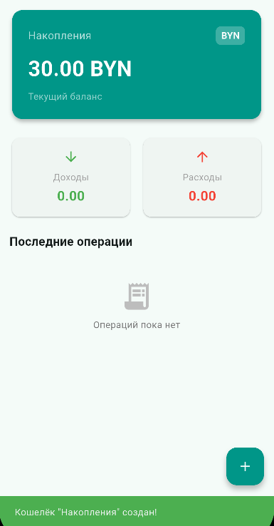
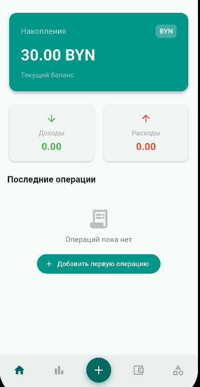

# Лабораторная работа №6 — Улучшение UX приложения Money Flow

## 1. Оценка атрибутов качества (ISO/IEC 25010:2011)

Согласно заданию, приложение оценивается по шести атрибутам группы Usability.

| Атрибут                         | Оценка   | Обоснование                                                                                                                          |
| ------------------------------- | -------- | ------------------------------------------------------------------------------------------------------------------------------------ |
| Распознаваемость соответствия   | ✅ Хорошо | Иконки wallet, bar_chart соответствуют функциям; цвета зелёный/красный однозначно кодируют доход/расход                              |
| Обучаемость                     | ❌ Слабо  | Нет онбординга и подсказок; пустое состояние показывает только текст «Операций пока нет» без кнопки действия                         |
| Используемость (операбельность) | ❌ Слабо  | Статистика и кошельки скрыты за иконками в AppBar — неочевидно; нет нижней навигации; удаление только через скрытый жест onLongPress |
| Защита от ошибок пользователя   | ✅ Хорошо | Форма добавления операции валидирует сумму; удаление требует подтверждения                                                           |
| Эстетика GUI                    | ✅ Хорошо | Material 3, скруглённые карточки, единая цветовая схема teal — визуально аккуратно                                                   |
| Доступность                     | ❌ Слабо  | Нет семантических меток Semantics, цветовой контраст не проверен, tooltip есть не у всех кнопок                                      |

***

## 2. Выбранные улучшения UX

Выбраны три улучшения с наибольшим влиянием на операбельность и обучаемость.

***

### Улучшение 1 — Нижняя навигация (BottomNavigationBar)

**Проблема (ДО):** Навигация между главным экраном и статистикой реализована через иконку в левом углу AppBar (`Icons.bar_chart`). Пользователь не догадывается, что это переход на отдельный экран. Категории и кошельки — в правом углу AppBar, тоже неочевидно. Согласно принципам Material Design, основная навигация должна находиться в нижней части экрана.

**Решение (ПОСЛЕ):** Заменить `BottomAppBar` с 5 элементами: Главная · Статистика · **➕ FAB** · Кошельки · Категории. При переключении с вкладки кошельков `_refreshKey++` пересоздаёт `HomeScreen` и `StatisticsScreen` с актуальным активным кошельком.

***

### Улучшение 2 — Свайп для удаления операции (Swipe to Delete)

**Проблема (ДО):** Единственный способ удалить операцию — долгое нажатие (`onLongPress`), которое открывает bottom sheet. Это скрытый жест, о котором пользователь не знает без подсказки. Стандартное ожидание в мобильных приложениях — удаление свайпом влево.

**Решение (ПОСЛЕ):** Обернуть каждую строку транзакции в виджет `Dismissible`. При свайпе влево появляется красный фон с иконкой корзины, после чего открывается диалог подтверждения удаления. Долгое нажатие для редактирования при этом сохраняется.

**📸 Скриншот ДО:** сделай скриншот списка операций — видно обычные тайлы без каких-либо визуальных подсказок к взаимодействию.

**📸 Скриншот ПОСЛЕ:** сделай скриншот в момент свайпа — видно красный фон с иконкой удаления, выезжающий из-под тайла.

***

### Улучшение 3 — Пустое состояние с призывом к действию (Empty State CTA)

**Проблема (ДО):** Когда операций нет, отображается только серый значок и текст «Операций пока нет». Нет никакой подсказки, что делать дальше. Пользователь, особенно новый, может не заметить FAB-кнопку в правом нижнем углу.

**Решение (ПОСЛЕ):** В блок пустого состояния добавить кнопку `FilledButton` с текстом «Добавить операцию», которая напрямую вызывает `_navigateToAddTransaction()`. Это устраняет неопределённость и сокращает путь до первого действия.

**📸 Скриншот ДО:** запусти приложение с пустым кошельком — виден только серый значок `receipt_long` и текст без кнопки.

**📸 Скриншот ПОСЛЕ:** там же добавлена teal-кнопка «Добавить операцию» под текстом.

***

## 3. Трассируемость задач

| Улучшение | Атрибут ISO 25010 | Изменённые файлы |
| :-- | :-- | :-- |
| Нижняя навигация с FAB | Используемость | `main_shell.dart`, `main.dart`, `home_screen.dart` |
| Swipe to Delete | Обучаемость, Используемость | `home_screen.dart` |
| Empty State CTA | Обучаемость | `home_screen.dart` |

***

## 4. Итоговые скриншоты «До / После»

### 4.1 Навигация

| До | После |
|---|---|
|  | |

### 4.2 Swipe to Delete

| До | После |
|---|---|
|  |  |

### 4.3 Пустое состояние

| До | После |
|---|---|
| |  |

---
